<!-- ╔══════════════════════════════════════════════════════════════════════════╗ -->
<!-- ║   ANCIENT ARCHIVE SYSTEM  ·  NODE: PRITHIBI_MANDI  ·  CYCLE: ∞        ║ -->
<!-- ║   CLEARANCE: MYTHIC  ·  STATUS: AWAKENED  ·  ORIGIN: UNCHARTED        ║ -->
<!-- ╚══════════════════════════════════════════════════════════════════════════╝ -->

<div align="center">


</div>

<br/>

<div align="center">

</div>

<br/>

---

<!-- ██████████████████████  I. ORIGIN  ██████████████████████ -->

<div align="center">


</div>

<br/>

```
╔══════════════════════════════════════════════════════════════════════╗
║  ARCHIVE LOG — RECORD #0001 — ENTITY: PRITHIBI_MANDI               ║
╠══════════════════════════════════════════════════════════════════════╣
║  DESIGNATION   : System Builder | Game Architect | Creative Technologist
║  ORIGIN REALM  : Unreal Engine · AI Systems · Web Platforms · Storytelling
║  RELIC MASTERY : Code, Craft, Creation
║  CURRENT STATE : Building worlds. Forging systems. Weaving myth into machine.
║  POWER UPLINK  : [ ████████████░░ ]  87% — SYSTEMS ACTIVE
╠══════════════════════════════════════════════════════════════════════╣
║  // "Not all who build leave blueprints. Some leave worlds."         ║
╚══════════════════════════════════════════════════════════════════════╝
```

<br/>

<!-- 🐍 SERPENT DIVIDER -->
<div align="center">

</div>

<br/>

<!-- ██████████████████████  II. RELIC SYSTEMS  ██████████████████████ -->

<div align="center">


</div>

<br/>

<div align="center">
<table>
<tr>
<td align="center" width="265">

```
╔══ FORGE RELICS ═════════╗
║                         ║
║  Unreal Engine  [■■■■░] ║
║  C++ / Blueprints[■■■░] ║
║  Game Mechanics [■■■░]  ║
║  Level Design   [■■■■] ║
║  Shaders / VFX  [■■░░]  ║
║                         ║
╚═════════════════════════╝
```

</td>
<td align="center" width="265">

```
╔══ WEB ARTIFACTS ════════╗
║                         ║
║  React / Next.js [■■■■] ║
║  Node.js         [■■■░] ║
║  Three.js        [■■■░] ║
║  TypeScript      [■■■░] ║
║  Tailwind CSS    [■■■■] ║
║                         ║
╚═════════════════════════╝
```

</td>
<td align="center" width="265">

```
╔══ AI SIGILS ════════════╗
║                         ║
║  Python          [■■■■] ║
║  ML Systems      [■■■░] ║
║  LLM Integration [■■░░] ║
║  Vision / NLP    [■■░░] ║
║  Generative AI   [■■■░] ║
║                         ║
╚═════════════════════════╝
```

</td>
</tr>
</table>
</div>

<br/>

<div align="center">


</div>

<br/>

<!-- 🐉 DRAGON GUARDIAN -->
<div align="center">

</div>

<br/>

<!-- ██████████████████████  III. ARCHIVE  ██████████████████████ -->

<div align="center">


</div>

<br/>

<div align="center">

<a href="https://github.com/Prithibi17">

</a>
&nbsp;
<a href="https://github.com/Prithibi17">

</a>

</div>

<br/>

<div align="center">

<a href="https://github.com/Prithibi17?tab=achievements">

</a>

</div>

<br/>

<!-- ██████████████████████  IV. SCROLL  ██████████████████████ -->

<div align="center">


</div>

<br/>

<div align="center">

<a href="https://github.com/Prithibi17">

</a>

</div>

<br/>

<!-- 🦅 EAGLE DIVIDER -->
<div align="center">

</div>

<br/>

<!-- ██████████████████████  V. ENERGY FLOW  ██████████████████████ -->

<div align="center">


</div>

<br/>

<div align="center">

<!-- CONTRIBUTION SNAKE -->
<!-- Activate: Create .github/workflows/snake.yml in this repo (see setup note at bottom) -->
<picture>
  <source media="(prefers-color-scheme: dark)"  srcset="https://raw.githubusercontent.com/Prithibi17/Prithibi17/output/github-contribution-grid-snake-dark.svg"/>
  <source media="(prefers-color-scheme: light)" srcset="https://raw.githubusercontent.com/Prithibi17/Prithibi17/output/github-contribution-grid-snake.svg"/>
  
</picture>

</div>

<br/>

<div align="center">


</div>

<br/>

<!-- 🦉 OWL DIVIDER -->
<div align="center">

</div>

<br/>

<!-- ██████████████████████  VI. FINAL LAW  ██████████████████████ -->

<div align="center">


</div>

<br/>

```
╔══════════════════════════════════════════════════════════════════════════╗
║   INSCRIPTION ON THE ARCHIVE WALL — CYCLE ∞                             ║
╠══════════════════════════════════════════════════════════════════════════╣
║                                                                          ║
║   I.    Every system has a soul. Find it. Code it. Ship it.              ║
║   II.   A game without story is architecture without inhabitants.        ║
║   III.  AI is not the tool. The question is the tool.                   ║
║   IV.   Build not for applause. Build for the ones who will find it      ║
║         long after you are gone.                                         ║
║                                                                          ║
╠══════════════════════════════════════════════════════════════════════════╣
║   — SIGNED : Prithibi Mandi, Architect of the Unnamed Realm             ║
╚══════════════════════════════════════════════════════════════════════════╝
```

<br/>

<!-- 🔥 FIRE CORE -->
<div align="center">

</div>

<br/>

<!-- 🐺 WOLF -->
<div align="center">

</div>

<br/>

<!-- ██████████████████████  CONNECT PROTOCOL  ██████████████████████ -->

<div align="center">


</div>

<br/>

<div align="center">

[](https://github.com/Prithibi17)
&nbsp;
[](https://github.com/Prithibi17)

</div>

<br/>

<div align="center">

</div>

<!-- ╔══════════════════════════════════════════════════════════════════════════╗ -->
<!-- ║   END OF ARCHIVE · NODE: PRITHIBI_MANDI · RECORD COUNT: ∞             ║ -->
<!-- ║   "Worlds are not discovered. They are built."                         ║ -->
<!-- ╚══════════════════════════════════════════════════════════════════════════╝ -->

<!--
════════════════════════════════════════════════════════════════
  ⚠  SETUP GUIDE — DEPLOY IN 3 STEPS
════════════════════════════════════════════════════════════════

STEP 1 — PROFILE REPO STRUCTURE:
  Create a public repo named exactly: Prithibi17
  Upload these files exactly as structured:

  Prithibi17/
  ├── README.md              ← this file
  └── assets/
      ├── serpent.svg
      ├── dragon.svg
      ├── eagle.svg
      ├── owl.svg
      ├── wolf.svg
      └── fire-core.svg

STEP 2 — CONTRIBUTION SNAKE:
  Create file: .github/workflows/snake.yml
  ────────────────────────────────────────────────────────────
  name: Generate Snake
  on:
    schedule:
      - cron: "0 0 * * *"
    workflow_dispatch:
  jobs:
    generate:
      runs-on: ubuntu-latest
      steps:
        - uses: Platane/snk@v3
          with:
            github_user_name: Prithibi17
            outputs: |
              dist/github-contribution-grid-snake.svg
              dist/github-contribution-grid-snake-dark.svg?palette=github-dark
        - uses: crazy-max/ghaction-github-pages@v3.1.0
          with:
            target_branch: output
            build_dir: dist
          env:
            GITHUB_TOKEN: ${{ secrets.GITHUB_TOKEN }}
  ────────────────────────────────────────────────────────────
  Then go to Actions tab → Run workflow (manually trigger once).

STEP 3 — STATS CARDS:
  All GitHub stats, streaks, trophies, and activity graph
  update automatically. No setup needed.

════════════════════════════════════════════════════════════════
-->
